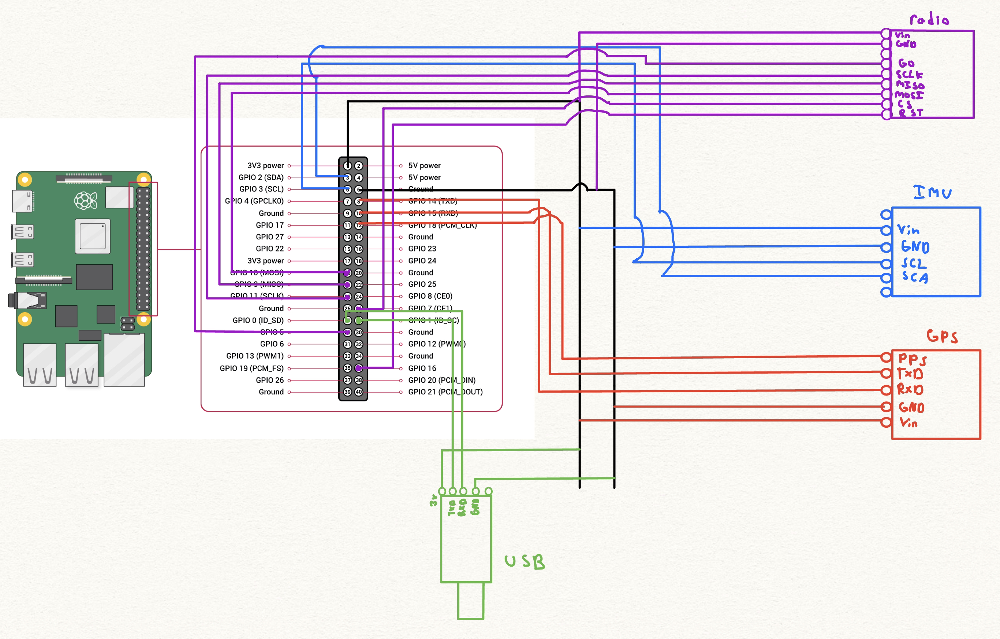

# Sensor Data Sender

This project is designed to read data from an IMU (Inertial Measurement Unit) and GPS (Global Positioning System) sensor, combine the data, and send it via UART, Radio, and logged via a CSV file in an attached SD card.

## Requirements

- Python 3.x
- Adafruit CircuitPython libraries
- Hardware:
  - BNO08x IMU sensor
  - GT-U7 GPS module
  - RFM95W LoRa radio module
  - Serial->USB adapter
  - Raspberry Pi (4b preferable)

## Installation / Setup

1. Wire everything according to the attached diagram:

2. Clone the repository to your raspberry pi.
3. Make a python virtual environment:
    ```sh
    python -m venv venv
    ```
4. Activate the virtual environment:
    ```sh
    source venv/bin/activate
    ```
5. Install the required Python libraries:
    ```sh
    pip install adafruit-circuitpython-bno08x adafruit-circuitpython-rfm9x pyserial
    ```
6. Ensure you have a linux computer (or at least something with access to a bash terminal) and clone the repo to that as well.
7. Connect the serial->USB adapter to your linux computer. **MAKE SURE THERE ARE NO OTHER USB DEVICES CONNECTED**
8. Run the sender script on the raspberry pi:
    ```sh
    python sender.py
    ```
9. Run the receiver script on the linux computer:
    ```sh
    sudo python3 receiver.py
    ```
10. From there, the receiver window should automatically update as soon as the raspberry pi can get the information (though the GPS connection can vary, as shown below):

11. If a automatic approach is wanted, you can set up a crontab command to run the start_sender.sh script(you will need to edit the correct file paths into it, it's a short script though) automatically on restart of the raspberry pi, such as the example below:
    ```sh
    @reboot /home/pi/SDProj2/start_sender.sh >> /home/pi/SDProj2/sender.log 2>&1
    ```
I won't go in depth on Crontab's setup here, but it is a useful automation tool and is very reliable.

## Code Explanation

Fundamentally, out project works with two main python scripts:
#### sender.py
1. GPS Data
- Grabbed by the program over a standard UART connection on the default pins.
- It is returned as a complex string of numbers with the starting line GPPGA, such as the example below:
```
$GPGGA,062556.00,3608.58471,N,09703.31644,W,2,09,1.25,290.6,M,-26.1,M,,0000*6E
```
- This is parsed using the `parse_gpgga(sentence)` function into a json-like string containing the important variables we want.

2. IMU Data
- Grabbed using Adafruit's I2C Library over the default I2C pins.
- It is easily formed into a json-like string in using Adafruit's library.

3. Sending the data over serial connection
- We connect a serial->usb adapter over a second UART port, which is enabled by altering the boot config.txt file.
- The two json strings above are combined together and converted into a proper json array.
- The json string is then encoded and sent over the serial connection
- In that same area, we also use this same JSON string again for the SD card and the radio

4. SD Card CSV File
- Two functions are defined to handle this, one to create a csv file if one is not present, and the other to add to it.
- The `initialize_csv()` function checks to see if the SD card is connected.  If it is, it will add a file if necessary, and fill the first row with the necessary column headers to make the data understandable.
- The 'save_to_csv(data)` function takes the existing full data json string and uses it to fill one new row of the csv file using a file add operation, so that way the file doesn't have to be completely overwritten.

5. Radio Operation
- The radio is connected using the default SPI connection, and a custom reset pin because the default was already taken.
- The radio primarily sends the data out in an encoded burst at 915 MHz, and is received by the program for testing purposes.
- For whatever reason and despite what Adafruit's website says, our radio is unable to send data longer than 5 bits.  So, the full json string is split into 4 bit chunks and each is individually sent.  For testing, each chunk is also received and dumped into a radio_log.txt file if it exists.  If the chunk is not received, a number is added into the log representing that chunk so we know it was not received.
- The radio was by far the most finicky part of this project, perhaps due to our janky antenna, hard to say.

#### receiver.py

1. USB Receiving
- The system checks to see if any USB devices are connected, and connects to the first one the system can identify.  This is why the code requires sudo priviledges to be run.
- Anytime data is identified, it grabs the json string and decodes it.
- Any components of it that are in mostly raw data form, such as the GPS coordinates, are parsed into their final forms.
- Some redundancy is added in, as the GPS might not always be able to return coordinates.  If it can't, any relevant GPS data is replaced with **N/A**

2. Graphics/UI
- Uses the Tkinter python library, and it is pretty straightforward to setup.
- Incorporates a "Main Menu", exit button, and a "View Data" button.
- Designed to just display the information in two vertical columns in that section of the program, as shown above.

## Additional explanation for project choices

Originally, this project was going to require far more processing power than it currently does, as I wasn't planning on using straight python.  That is why a raspberry pi 4b was chosen.  But, it became apparent that with the different forms of connections we wanted (particularly the usb-serial setup) that straight python made the most sense as it was the most documented approach.  In hindsight, an arduino and C++ approach would have made more sense for how much easier it made usb connections.

At first we bought whatever Amazon parts met the specifications we wanted, but we realized over time that Adafruit's documentation was so good and their parts were so much more reliable for this application that we wound up having to swap the IMU and radio out for their parts.

One strong advantage of our setup is how easy automation is.  Crontab allows us to have a script run on reboot that grabs the packages we need by sourcing the virtual environment, then runs the script and puts it's output to a log file, all on it's own.
A significant disadvantage is how much configuration the pi needed while testing was being done, though the final version doesn't need to change much.

## Help / Additional Pi Setup
First, I2C, serial, and SPI all need to be enabled in your interface settings, which you can do by accessing the settings menu with:
```
sudo raspi-config
```
**Don't allow the login shell to be accessible over serial.**

I found the raspberry pi needed an additional UART port enabled, and the baud rate for the I2C connectors needed to be raised a lot.  You need to edit the **/boot/firmware/config.txt** file and add these lines to the bottom:
```
dtparam=i2c_arm_baudrate=400000
dtoverlay=disable-bt
dtoverlay=uart1
dtoverlay=uart2
```

## Functions

#### sender.py
- `radio_send(data)`: Sends data via the LoRa radio module in chunks.
- `read_imu_data()`: Reads data from the IMU sensor.
- `parse_gpgga(sentence)`: Parses GPS data from a GPGGA sentence.
- `read_gps_data()`: Reads GPS data from the serial port.
- `initialize_csv()`: Initializes the CSV file with headers if it doesn't exist.
- `save_to_csv(data)`: Saves data to the CSV file.

#### receiver.py
- `show_data_view(self)`: Switches the GUI to the data view frame, where sensor data is displayed.
- `show_main_menu(self)`: Switches the GUI back to the main menu frame.
- `exit_program(self)`: Exits the application.
- `update_data_labels(self)`: Updates the data labels in the data view frame with new sensor data.
- `receive_data(self)`: Continuously receives data from the serial port and updates the GUI with the received data.
- `start_receiving(self)`: Starts a new thread to run the receive_data function.
- `__init__(self, root)`: Initializes the DataReceiver class, sets up the main window, and initializes GUI components for the main menu and data view.